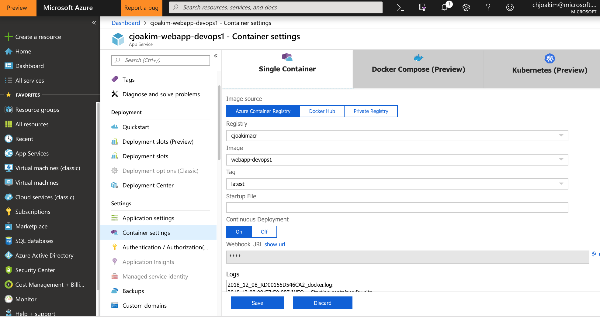

# azure-webapp-devops1

A containerized Node.js web app, built with **Azure DevOps**, deployed to a Azure Linux App Service. 
Also deployed to an Azure Container Instance.

This project is a "200-Level" example of Docker, Azure DevOps, Node.js web apps, and Azure deployments.

# Links

See https://docs.microsoft.com/en-us/azure/container-instances/container-instances-using-azure-container-registry

# Azure PaaS Services

This project assumes that you already have the following:
- git, Node.js, and Docker installed on your computer
- An DockerHub account for your Docker images
- An Azure Container Registry (ACR) for your Docker images
- An Azure DevOps account

We'll create the following PaaS services in this project with the Azure CLI:
- An Azure KeyVault (AKV)
- An Azure Container Instance (ACI) to run the web app container in

Also create the following PaaS service in this project with the Azure Portal:
- An Azure Linux App Service to run the ACR web app container in

---

# Project setup on your Workstation

```
$ git clone https://github.com/cjoakim/azure-webapp-devops1.git
$ cd azure-webapp-devops1
$ npm install
$ grunt
```

```
git remote add origin git@ssh.dev.azure.com:v3/chjoakim/azure-webapp-devops1/azure-webapp-devops1
git push -u origin --all
```

## Workstation Environment Variables

Set the following environment variables for your Azure Container Registry (ACR),
Azure Key Vault (AKV), and DockerHub account.

Example values shown below.
```
AZURE_ACR_NAME=cjoakimacr
AZURE_ACR_USER_NAME=cjoakimacr
AZURE_ACR_USER_PASS=<secret>
AZURE_ACR_LOGIN_SERVER=cjoakimacr.azurecr.io

AZURE_AKV_NAME=cjoakim-keyvault
AZURE_AKV_RG=cjoakim-keyvault

DOCKERHUB_USER_NAME=your-dockerhub-user-id
DOCKERHUB_USER_PASS=your-dockerhub-user-password
```

# The DevOps Pipeline

File **azure-pipelines.yml** defines the Pipeline in AzureDevops;
you include this file with your application code in your git code repository.

This particular Pipeline, which runs on an Ubuntu VM, consists of three explicit
steps and one implicit step.  The first step is implicit - Azure DevOps executes
a 'git pull' of your repo to the build VM.

The explicit steps in this pipeline are:
- displays some pipeline variables for debugging/verification purposes
- executes the explore_build_env.sh bash script
- Builds your Docker image
  - executes Grunt to create the build_timestamp.json file
  - npm install
  - Docker build
  - Push to build image to your DockerHub account
  - Tag and push to build image to your Azure Container Registry

After your new image is pushed to ACR and/or DockerHub it is available for
either automated or manual deployment to Azure services, such as Azure App Service
or Azure Container Instance.

# DevOps Pipeline Variables

File **azure-pipelines.yml** defines the Pipeline, and the following variables inline;
edit these per your DockerHub and Azure Container Registry accounts.

Specify your application and build **secrets** in Azure DevOps as Pipeline Variables
rather than inline in your code (i.e. - the azure-pipelines.yml file).

Pipelines -> Select -> Edit -> Edit in the Visual Designer -> Click Variables Tab

Password variables **dockerPw** and **acrPw** are defined in the DevOps pipeline itself,
rather that in the yaml file.

```
variables:
  dockerId:  'cjoakim'
  acrName:   'cjoakimacr'
  acrServer: 'cjoakimacr.azurecr.io'
  acrUser:   'cjoakimacr'
  buildTag:  'latest'
  imageName: 'webapp-devops1:latest'
  # dockerPw:  <- this is a pipeline variable
  # acrPw:     <- this is a pipeline variable
```

---

# Azure KeyVault Setup

## Create the KeyVault

An Azure KeyVault (AKV) is used to store secrets for interacting via automation with
your Azure Container Registry.

```
$ az keyvault create -g $AZURE_AKV_RG -n $AZURE_AKV_NAME
```

## Create a service principal and store credentials in AKV

```
$ az keyvault secret set \
  --vault-name $AZURE_AKV_NAME \
  --name $AZURE_ACR_NAME-pull-pwd \
  --value $(az ad sp create-for-rbac \
                --name $AZURE_ACR_NAME-pull \
                --scopes $(az acr show --name $AZURE_ACR_NAME --query id --output tsv) \
                --role reader \
                --query password \
                --output tsv)
```

## Store service principal ID in AKV

```
$ az keyvault secret set \
    --vault-name $AZURE_AKV_NAME \
    --name $AZURE_ACR_NAME-pull-usr \
    --value $(az ad sp show --id http://$AZURE_ACR_NAME-pull --query appId --output tsv)
```

## Results of the above

You've created an Azure Key Vault and stored two secrets in it:
```
$AZURE_ACR_NAME-pull-usr: The service principal ID, for use as the container registry username.
$AZURE_ACR_NAME-pull-pwd: The service principal password, for use as the container registry password.
- or -
cjoakimacr-pull-usr
cjoakimacr-pull-pwd
```

---

# Deploy container to Azure Container Instance with Azure CLI

See file **create_ci.sh** in this repo, which contains the following:

```
instance_name="cjoakim-devops"
image_name="cjoakimacr.azurecr.io/webapp-devops1:latest"

az container create \
    --name $instance_name \
    --resource-group $AZURE_ACI_RG \
    --image $image_name \
    --registry-login-server $AZURE_ACR_NAME.azurecr.io \
    --registry-username $(az keyvault secret show --vault-name $AZURE_AKV_NAME -n $AZURE_ACR_NAME-pull-usr --query value -o tsv) \
    --registry-password $(az keyvault secret show --vault-name $AZURE_AKV_NAME -n $AZURE_ACR_NAME-pull-pwd --query value -o tsv) \
    --dns-name-label $instance_name-$RANDOM \
    --query ipAddress.fqdn \
    --ports 80 443
```

---

# Continuous Deployment to your Azure Linux App Service

Configure your App Service container settings as follows:
- Specify your image in Azure Container Registry
- set Continuous Deployment to 'On'



---

# Helper Bash Script

See **container.sh**; it offers the following functions:

```
Usage:
  ./container.sh build_image
  ./container.sh run_local
  ./container.sh login_dockerhub
  ./container.sh push_dockerhub
  ./container.sh login_acr
  ./container.sh push_acr
  ./container.sh list_acr
  ./container.sh delete_acr_image <image-name>
  ./container.sh delete_acr_image webapp-devops1-devops
  ./container.sh ci_restart <rg> <name>
  ./container.sh ci_restart cjoakim-aci cjoakim-aci1
```

---

# Bash Aliases

I use these aliases, defined in ~/.bash_profile
```
# docker:
# see https://github.com/tcnksm/docker-alias/blob/master/zshrc
dklbash() { docker exec -it $(docker ps -l -q) bash; } # bash into the latest container ID
alias dkex="docker exec -it"         # Execute interactive container; dkex c9ce2ad6f242 bash
alias dki="docker run -it -P"        # Run interactive container, e.g., $dki base /bin/bash
alias dkimg="docker images"            # Get images
alias dkip="docker inspect --format '{{ .NetworkSettings.IPAddress }}'" # Get container IP
alias dklid="docker ps -l -q | pbcopy && pbpaste" # Get latest container ID
alias dkps="docker ps"                 # Get process list
alias dkpsa="docker ps -a"             # Get process list including stopped
alias dkrm="docker rm $(docker ps -a -q)"           # Remove stopped containers
alias dkrmall="docker rmi $(docker images -q)"      # Remove all images
alias dkrmstopped="docker rm $(docker ps -a -q)"    # Remove stopped containers
alias dkstop1="docker stop -t 1 $(docker ps -l -q)" # Stop the latest running container ID
alias dkstopall="docker stop $(docker ps -a -q)"    # Stop all running containers

# docker-compose:
alias dkcup="docker-compose up"
alias dkcps="docker-compose ps"

# Show all docker aliases
dkaliaslist() { alias | grep 'docker' | sed "s/^\([^=]*\)=\(.*\)/\1 => \2/"| sed "s/['|\']//g" | sort; }
```
